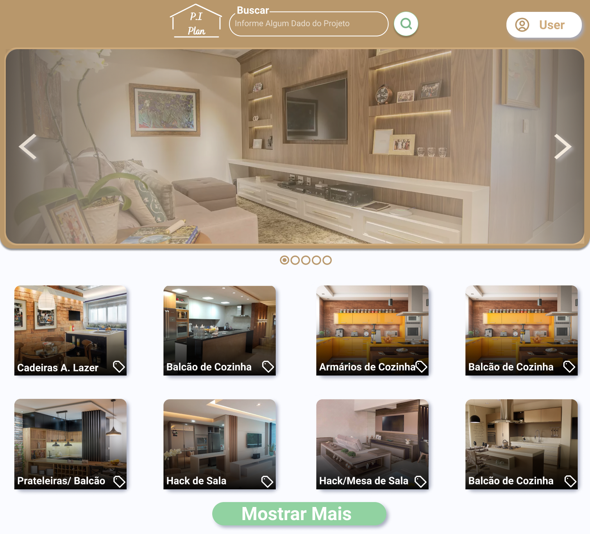
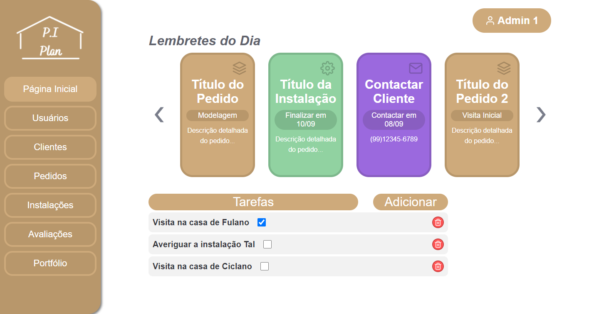
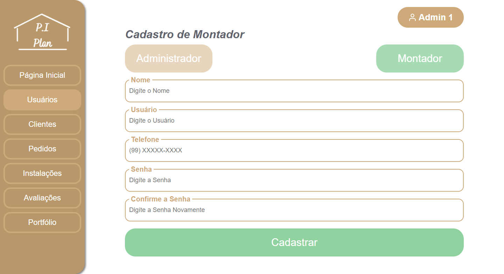
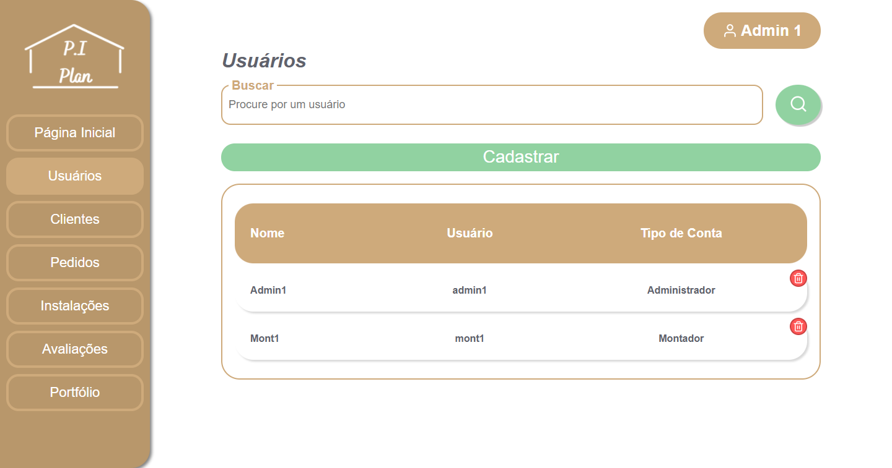
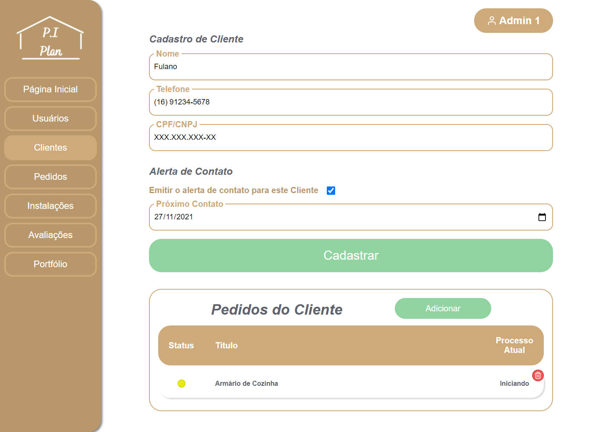
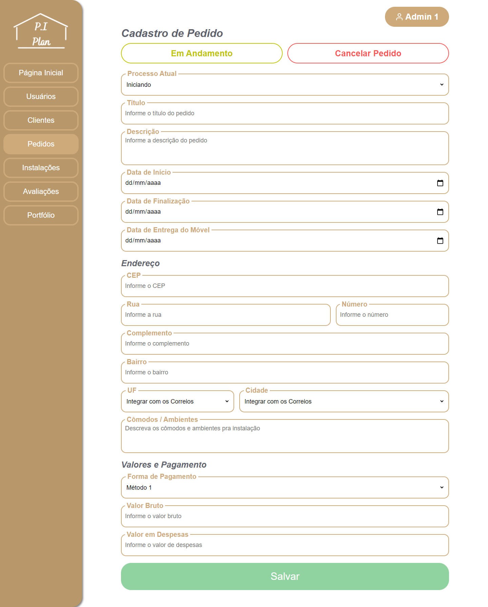
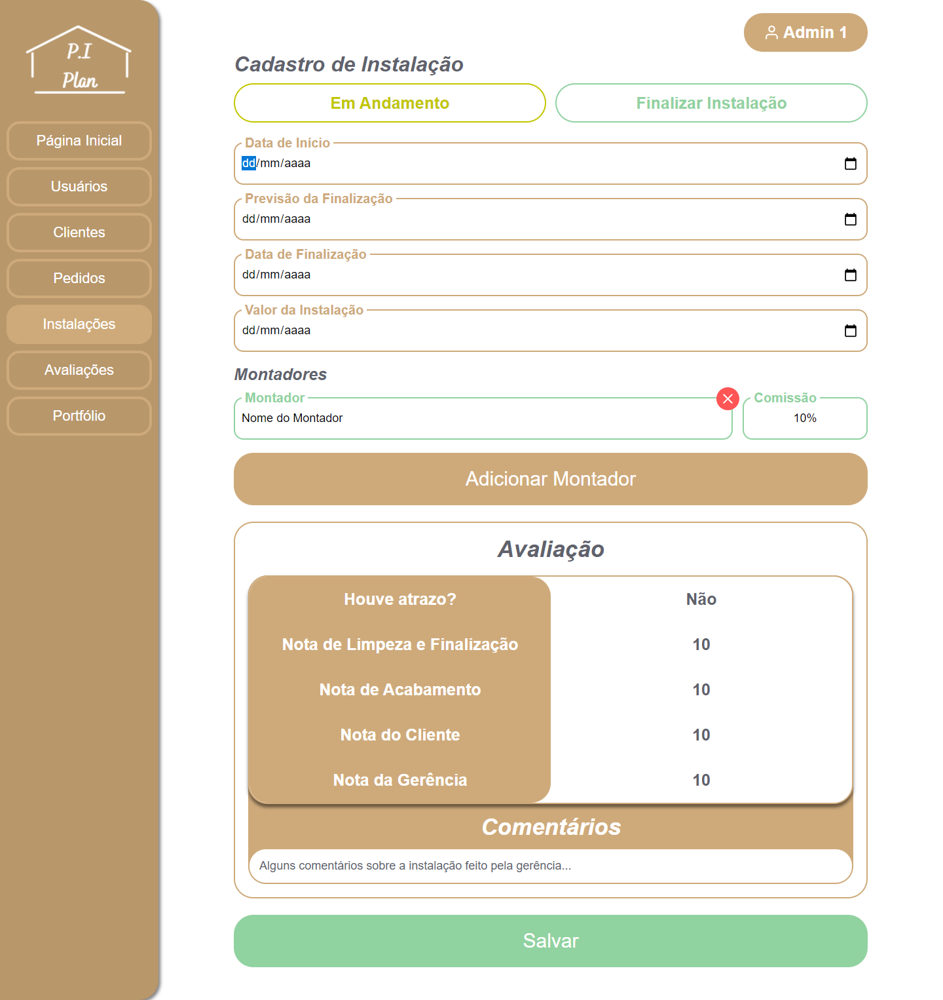
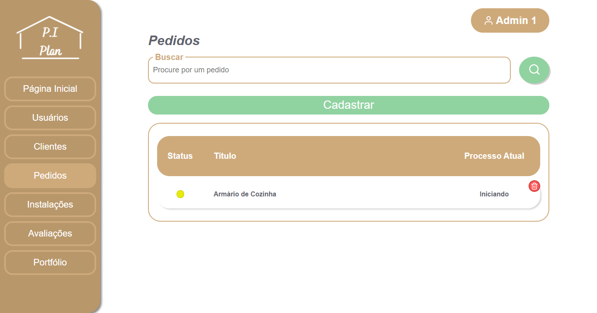

# PI-Plan - Gestão de Pedidos de Móveis Planejados
## Controle de Ponta a Ponta dos pedidos de móveis planejados

Software para a empresa de móveis planejados P.I. Planejados Inteligentes

## Algumas Telas

**Home - Portfólio**

 
 
**Login**

 
 
**Dashboard**

 
 
**Cadastro de Usuário**

 
 
**Listagem dos Usuários**

 
 
**Cadastro de Clientes**

 
 
**Cadastro de Pedidos**

 
 
**Cadastro de Instalação**

 
 
**Listagem dos Pedidos**

 
 
**Listagem das Avaliações**

# 🤝 Colaboradores

<table>
  <tr>
    <td align="center">
      <a href="https://github.com/Vini7Dev">
         
        
          <b>Vinícius Gabriel</b>
        
      </a>
    </td>

  <td align="center">
    <a href="https://github.com/PedroSMarcal">
       
      
        <b>Pedro Marçal</b>
      
    </a>
  </td>

  <td align="center">
    <a href="https://github.com/preduouh">
       
      
        <b>Pedro Zuviollo</b>
      
    </a>
  </td>
  </tr>
</table>
