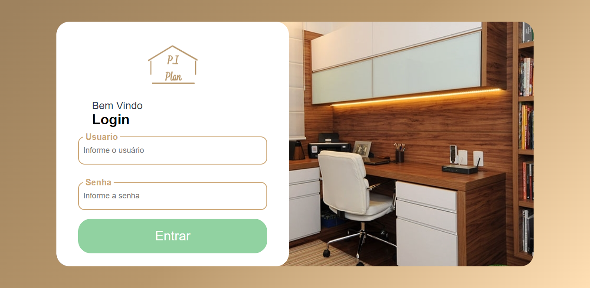
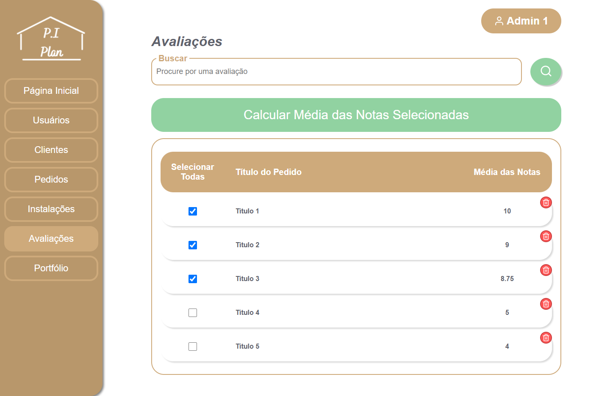

# PI-Plan - Gestão de Pedidos de Móveis Planejados
## Controle de Ponta a Ponta dos pedidos de móveis planejados

Software para a empresa de móveis planejados P.I. Planejados Inteligentes

## Algumas Telas

**Home - Portfólio**

 
 
**Login**

 
 
**Dashboard**

 
 
**Cadastro de Usuário**

 
 
**Listagem dos Usuários**

 
 
**Cadastro de Clientes**

 
 
**Cadastro de Pedidos**

 
 
**Cadastro de Instalação**

 
 
**Listagem dos Pedidos**

 
 
**Listagem das Avaliações**

